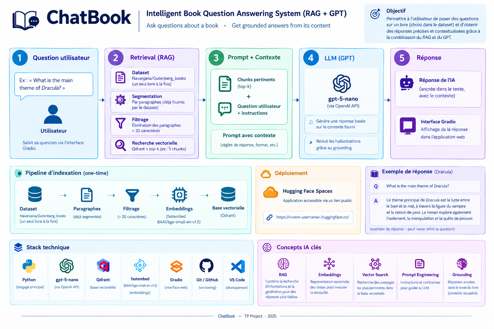
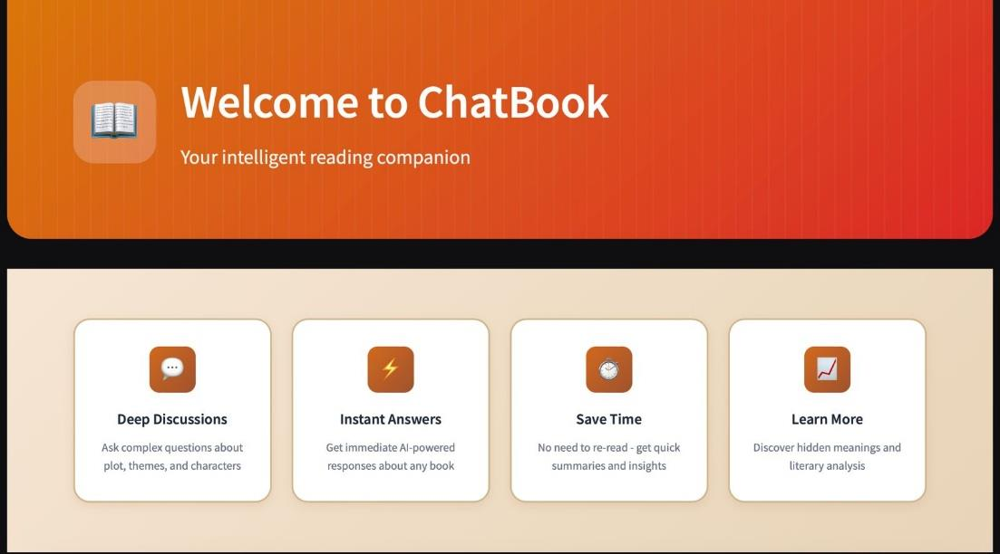
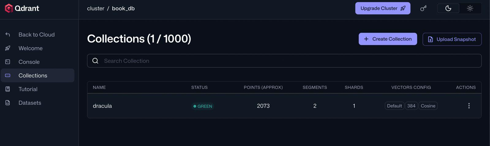
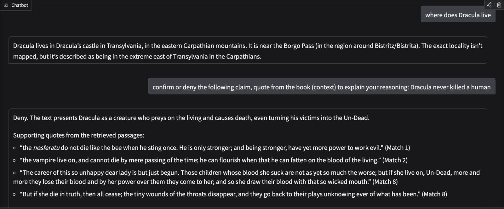

**A RAG assistant that answers questions about public-domain books, using only passages retrieved from the book.**

Enter a book title and ChatBook indexes it, finds the passages most relevant to your question with semantic search, and asks an LLM to answer from those passages rather than from its own memory.

🔗 **Live demo:** [huggingface.co/spaces/ccv2025/book-chat](https://huggingface.co/spaces/ccv2025/book-chat)

---

## Overview

Large language models can invent details when asked about a specific text. ChatBook reduces this risk with a RAG pipeline: the most relevant passages of the book are retrieved first, then passed to the model, which is instructed to answer only from that context.



## Features

- Chat with one public-domain book at a time, chosen by title
- Title matching that tolerates small variations (exact match, then case-insensitive substring match)
- Semantic search over the book, so rephrased questions still find the right passages
- Answers generated from the retrieved passages only; the model is instructed to say it does not know otherwise
- Passages are labeled `[Match i]`, so the assistant can quote its supporting evidence when asked
- On-demand indexing with caching: a book is processed once, then reused
- Gradio interface with loading and error feedback; the chat appears once the book is ready

## Screenshots

| Home | Indexed book in Qdrant |
|---|---|
|  |  |



*Example: after indexing Dracula, the assistant answers a factual question, then checks a claim using quotes from the retrieved passages.*

## How it works

**Phase 1: Book preparation (once per book)**

1. The book is read from the [`Navanjana/Gutenberg_books`](https://huggingface.co/datasets/Navanjana/Gutenberg_books) dataset in streaming mode (no full download).
2. Paragraphs are already segmented by the dataset. Those shorter than 20 characters are discarded.
3. Each paragraph is embedded with `BAAI/bge-small-en-v1.5` (384 dimensions) through `fastembed`.
4. Vectors are upserted in batches into a Qdrant collection dedicated to the book (lowercase name with underscores, cosine distance). The paragraph text is stored as the payload.

**Phase 2: Question answering (every message)**

1. The question is embedded with the same model.
2. Qdrant returns the top 10 most similar paragraphs.
3. The passages are formatted as `[Match i] (score=...)` and inserted into a developer prompt that restricts the answer to this context.
4. `gpt-5-nano` generates the answer, displayed in the Gradio chat.

## Tech stack

| Component | Role |
|---|---|
| Python | Main language |
| Gradio | Web interface |
| Hugging Face Datasets | Streaming access to the Gutenberg corpus |
| fastembed (`BAAI/bge-small-en-v1.5`) | Text embeddings |
| Qdrant | Vector database and similarity search |
| OpenAI API (`gpt-5-nano`) | Answer generation |
| Hugging Face Spaces | Deployment |

## Getting started

### Prerequisites

- Python 3.10+
- An OpenAI API key
- A Qdrant instance (Qdrant Cloud or self-hosted) and its API key

### Installation

```bash
git clone <repository-url>
cd <repository-folder>
pip install -r requirements.txt
```

### Configuration

Set the following environment variables:

```bash
export CHATGPT_API_KEY="your-openai-api-key"
export QDRANT_URL="https://your-qdrant-instance"
export QDRANT_API_KEY="your-qdrant-api-key"
```

### Run

```bash
python app.py
```

Then open the local URL printed by Gradio.

## Project structure

```
├── app.py             # Gradio interface and app entry point
├── backend/           # Indexing, retrieval and generation logic
├── docs/              # Documentation assets
└── requirements.txt
```

## Limitations

- English books only
- Public-domain books available in the dataset only
- Indexing happens on demand, so the first request for a new book is slower
- The selected book is stored globally and shared between concurrent users
- Retrieval uses a fixed top-k with no score threshold or reranking
- Grounding relies on the prompt and the retrieved context: it reduces hallucinations but does not guarantee their absence

## Possible improvements

- Reranking with a cross-encoder
- Similarity score threshold
- Multilingual embeddings
- Per-session book selection
